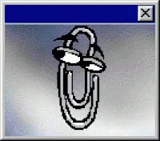

<!-- I am in your extended network! -->
<table border=1 cellspacing=0 cellpadding=0>
  <tr>
    <td>
      

         
        <strong>Zachary Flower is in your extended network</strong> 
        
      

    </td>
  </tr>
</table>

  <strong>Zachary Flower's Latest Blog Entry</strong> [<strong><a href="https://flower.codes">Subscribe to this Blog</a></strong>]

 

  WTF is a Postmortem?  (<strong><a href="https://flower.codes/2022/01/05/wtf-is-a-postmortem.html">view more</a></strong>)

 

  2021: The Retrospective  (<strong><a href="https://flower.codes/2022/01/04/2021-retrospective.html">view more</a></strong>)

 

  Hello Darkness, My Old Friend  (<strong><a href="https://flower.codes/2021/11/14/dark-mode.html">view more</a></strong>)

 

  From the Kitchen of...  (<strong><a href="https://flower.codes/2021/10/15/from-the-kitchen-of.html">view more</a></strong>)

 

  New Job, Who Dis?  (<strong><a href="https://flower.codes/2021/08/12/new-job-who-dis.html">view more</a></strong>)

 

  [<strong><a href="https://flower.codes">View All Blog Entries</a></strong>]

  

 

 

Hi there. I'm <strong>Zach</strong>. Welcome to my profile. Obviously I'm experimenting with that classic <strong>MySpace</strong> look (within the limitations of <strong>GitHub's</strong> markdown renderer). Like a lot of developers my age, tweaking the look and feel on a MySpace page was one of my earliest exposures to HTML and JavaScript, so this felt like an appropriate homage to that time. Feel free to drop me a line or open a PR if you have any ideas on how to improve the attempt.

 
 

A few things I want to do at some point:

 

• Automatically update the recent blog post list

 

• Update the "friend count" number

 

• Render the "friend count" number as an SVG so it can be the proper color (red)

 

• Figure out a realistic comments system

 

• Kill the GitHub table for the friends list and use an SVG to better match the style

 

 

I have a pretty big list of nerd heroes that I'd love to meet someday, but after taking a trip down memory lane to put this profile together, I'd love to meet AOL's "You've Got Mail" guy. Preferably over the phone. Don't want to ruin the magic.

 

 

<strong>Zachary Flower has 53 friends.</strong>

 
 
<table border=0 cellspacing=0 cellpadding=0>
<tr>
<td>

<strong><a href="https://github.com/zachflower">Tom</a></strong>

 

</td>
<td>

<strong><a href="https://github.com/zachflower">Clippy</a></strong>

 

</td>
<td>
  
</td>
<td>
  
</td>
</tr>
</table>
